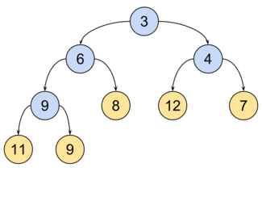

# Нижняя граница на время работы очереди с приоритетом

## Теория:

Очередь с приоритетом -- абстрактный тип данных, где у каждого элемента есть приоритет, подерживающий операции:

- `insert` или `push` -- вставка нового элемента
- `extractMin` или `extractMax` -- извлечь элемент с наибольшим приоритетом

## Утверждение:

Для реализации очереди с приоритетом на основе сравнений *нижняя граница* времени работы операции `extractMin` (и, как
следствие, любой операции, изменяющей структуру)
равна `Ω(log n)`, где `n` -- количество элементов.

## Доказательство:

1. Предположим, существует реализация очереди с приоритетом, где `extractMin` работает за врему `o(log n)` (строго
   меньше логарифма).
2. Тогда с помощью такой очереди можно реализовать алгоритм сортировки сравнениями:
    - Вставить все элементы входного массива в очередь
    - Последовательно извлечь все элементы -- они извлекутся в отсортированном порядке
3. Сложность такого алгоритма:
    - `n` вставок `n * t_insert`
    - `n` извлечений `n * t_extract`
    - Общее время: `n * (t_insert + t_extract)`
4. Если `t_insert = o(log n)` и `t_extract = o(log n)`, то общее время сортировки было бы `o(n * log n)`
5. Это противоречит нижней оценке для алгоритмов сортировки сравнениями `Ω(n * log n)`
6. Следовательно, предположение неверно, хотя бы одна из операций должна иметь нижнюю границу `Ω(n * log n)` для
   реализации на основе сравнений

# Бинарная куча

## Теория:

Двоичная куча -- такое двоичное подвешенное дерево, для которого выполнены следующие три условия:

- Значений в любой вершине не больше (если куча для минимума), чем значение ее потомков
- На i-ом слое 2^i вершин, кроме последнего. Слои нумеруются с нуля.
- Последний слой заполнен слева направо



## Базовые процедуры

### Восстановление свойств кучи

Если в куче изменяется один из элементов, то она может перестать удовлетворять свойству упорядоченности.
Для восстановления этого свойства служат процедуры `siftDown` и `siftUp` (просеивание вниз/вверх).

*siftDown* -- если значение измененного элемента увеличивается, то свойства кучи восстанавливаются функцией `siftDown`

Работа процедуры -- если i-ый элемент меньше, чем его сыновья, все поддерево является кучей, и делать ничего не надо.
В противном случае, меняем местами i-ый элемент с наименьшим из его сыновей, после чего выполняем `siftDown` для этого
сына.
Продцедура выполняется за `O(log n)`.

*siftUp* -- если значение измененного элемента уменьшается, то свойства кучи восстанавливается функцией `siftUp`.

Работа процедуры -- если элемент больше своего отца, условие 1 соблюдено для всего дерева. Иначе, мы меняем местами его
с отцом.
После чего выполняем `siftUp` для этого отца. Иными словами, сликшом маленький элемент всплывает наверх. Процедура
выполняется за время `O(log n)`

### Извлечение минимального элемента

Выполняет извлечение минимальног элемента из кучи за время O(log n). Извлечение выполняется в 4 этапа:

- Значение корневого элемента (он и является минимальным элементом) сохраняется для последующего возврата
- Последний элемент копируется в корень, после чего удаляется из кучи
- Вызывается `siftDown` для корня
- Сохраненный элемент возвращается

### Добавление нового элемента

Выполняет добавление элемента в кучу за время O(log n). Добавление произвольного элемента в конец кучи, и восстановление
свойства упорядоченности с помощью `siftUp`

### Построение кучи за O(n)

#### Определение

D-куча -- куча, в которой у каждого элемента, кроме, возможно, элементов на последнем уровне, ровно d потомков.

Дан массив a[0...n-1]. Требуется построить d-кучу с минимумом в корне. Наиболее очевидный способ построить такую кучу из
неупорядоченного массива -- сделать нулевой элемент массива корнем, а дальше по очереди добавить все его элементы в
конец кучи и запускать от каждого такого добавления `siftUp`. O(n * log n). Однако можно посмтроить кучу еще быстрее --
за O(n).

Представим, что в массиве хранится дерево. Сделаем `siftDown` для вершин, имеющих хотя бы одного потомка: от n/d до 0,
тк поддеревья, состоящие из одной вершины без потомков, уже упорядочены.

#### Лемма

На выходе получим искомую кучу

#### Доказательство

До вызова `siftDown` для вершины, ее поддеревья являются кучами. После выполнения `siftDown` эта вершина с ее
поддеревьями будут также являться кучей. Значит, после выполнения всех `siftDown` получится куча.

#### Лемма

Время работы этого алгоритма O(n)

#### Доказательство

Лучше глянуть на сайте итмо, потому что мне лень вбивать мат символы

https://neerc.ifmo.ru/wiki/index.php?title=%D0%94%D0%B2%D0%BE%D0%B8%D1%87%D0%BD%D0%B0%D1%8F_%D0%BA%D1%83%D1%87%D0%B0

# Поразрядная сортировка

## Теория

Поразрядная сортировка -- один из алгоритмов сортировки, использующих внутреннюю структуру сортируемых объектов.

## Алгоритм

Имеем множество последовательностей одинаковой длины, состоящих из элементов, на которых задано отношение линейного
порядка.
Требуется отсортировать эти последовательности в лексикографическом порядке.

По аналогии с разрядами чисел будем называть элементы, из которых состоят сортируемые объекты, разрядами. Сам алгоритм
состоит в последовательной сортировке объектов какой-либо устойчивой сортировкой по каждому разряду, в порядке от
младшего разряда к старшему, после чего последовательности будут расположены в требуемом порядке.

Для чисел и строк наиболее часто в качестве устойчивой сортировки применяют сортировку подсчетом.

```
сортирвка подсчетом -- лгоритм сортировки целых чисел в диапазоне от 0
до некоторой константы k
или сложных объектов, работающий за линейное время.
```

Если сортируем с младших разрядов (справа налево), то это LSD (least significant digit)-sort, если слева направо, то это
MSD (most significant digit)-sort

## Корректность

Докажем, что алгоритм работает верно, используя метод мат индукции по номеру разряда. Пусть n -- количество разрядов в
сортируемых объектах

*База* -- n = 1, очевидно, что алгоритм работает корректно. Просто сортируем младшие разряды заранее выбранной
устойчивой сортировкой

*Переход* -- пусть для n = k, алгоритм правильно отсортировал последовательности по k младшим разрядам. Покажем, что по
k+1 разряду, последовательности также будут отсортированы в правильном порядке.

Вспомогательная сортировка разобъет все объекты на группы, в которых (k+1)-ый разряд объектов одинаковый. Рассмотрим
такие группы. Для сортировки по отдельным разрядам мы используем устойчивую сортировку, следовательно порядок объектов с
одинаковым (k+1)-м разрядом не изменился. Но по предположению индукции по предыдущим k
разрядам последовательности были отсортированы правильно, и поэтому в каждой такой группе они будут отсортированы верно.
Также верно, что сами группы находятся в правильном относительно друг друга порядке, а, следовательно, и все объекты
отсортированы правильно по (k+1)-м младшим разрядам.

## Сложность (на примере LSD)

Пусть m — количество разрядов, n — количество объектов, которые нужно отсортировать, T(n) — время работы устойчивой
сортировки. Цифровая сортировка выполняет k итераций, на каждой из которой выполняется устойчивая сортировка и не более
O(1) других операций. Следовательно время работы цифровой сортировки — O(kT(n)).

Рассмотрим отдельно случай сортировки чисел. Пусть в качестве аргумента сортировке передается массив, в котором
содержатся n m-значных чисел, и каждая цифра может принимать значения от 0 до k−1. Тогда цифровая сортировка позволяет
отсортировать данный массив за время O(m(n+k)), если устойчивая сортировка имеет время работы O(n+k). Если k
небольшое, то оптимально выбирать в качестве устойчивой сортировки сортировку подсчетом.

Если количество разрядов — константа, а k=O(n), то сложность цифровой сортировки составляет O(n), то есть она линейно
зависит от количества сортируемых чисел.
